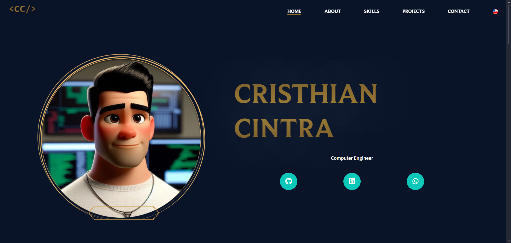
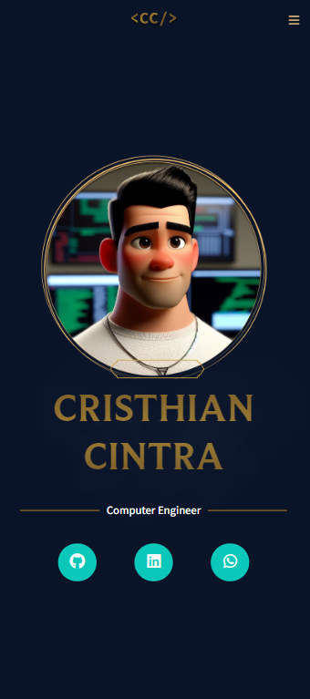

# Cristhian Cintra's Personal Portfolio

This is a personal portfolio project built using React and Styled Components, designed to showcase my work, skills, and professional experiences in a modern and interactive way.

## 🚀 Technologies Used

- **React:** JavaScript library for building user interfaces.
- **Styled Components:** A library for styling React components using CSS-in-JS.
- **JavaScript** (ES6+)

## ✨ Features

- "About Me" page with a brief overview of his professional journey
- "Skills" section featuring the technologies and tools I work with
- "Projects" page showcasing his work with images, descriptions, and links to live demos or GitHub
- Contact form for recruiters or clients to reach out to me
- Fully responsive design, adapted for various devices (desktops, tablets, mobile phones)

## 📁 Folder Structure

📦cintra
┣ 📂public
┣ 📂src
┃ ┣ 📂assets
┃ ┃ ┣ 📂fonts
┃ ┃ ┗ 📂img
┃ ┣ 📂components
┃ ┃ ┣ 📂 common
┃ ┃ ┃ ┣ 📂 button
┃ ┃ ┃ ┗ 📜 index.jsx
┃ ┃ ┃ ┣ 📜Column.jsx
┃ ┃ ┃ ┣ 📜Divider.jsx
┃ ┃ ┃ ┣ 📜Layout.jsx
┃ ┃ ┃ ┣ 📜PageLayout.jsx
┃ ┃ ┃ ┣ 📜Row.jsx
┃ ┃ ┃ ┣ 📜SectionTitle.jsx
┃ ┃ ┗ 📂 navbar
┃ ┣ 📂constants
┃ ┃ ┗ 📜colors.js
┃ ┣ 📂hooks
┃ ┃ ┗ 📜useMediaQuery.js
┃ ┣ 📂utils
┃ ┃ ┗ 📜texts.js
┃ ┣ 📂views
┃ ┃ ┗ 📂about
┃ ┃ ┗ 📂contact
┃ ┃ ┗ 📂home
┃ ┃ ┗ 📂projects
┃ ┃ ┗ 📂skills
┃ ┣ 📜App.js
┃ ┣ 📜GlobalStyle.jsx
┃ ┣ 📜index.js
┗ 📜README.md

## 🛠️ How to Run the Project

1. Clone the repository:

   ```bash
   git clone https://github.com/BeatrizNeaime/cintra-portfolio.git
   ```

2. Install the dependencies

   ```bash
    cd portfolio
    npm install
   ```

3. Start the development server

```bash
  npm start
```

## 📸 Screenshots

### Home Page

<div style="display: flex;" >


</div>
